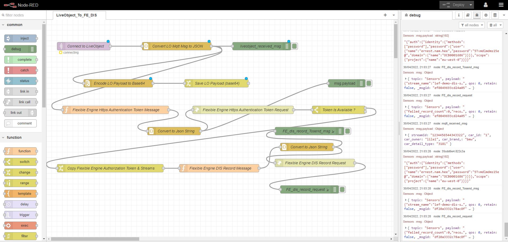

# IEF Edge Demonstration

This demonstration illustrates how Flexible Engine Intelligent Edge Fabric IEF (https://cloud.orange-business.com/en/offers/infrastructure-iaas/public-cloud/features/intelligent-edge-fabric/) can be used to deploy an IOT Edge Application on servers, and devices located at the Edge (Customer Data Center , Warehouse, ...) from central cloud on Flexible Engine. Application written could be deployed in the cloud or at the Edge thanks to Flexible Engine Intelligent Edge Fabric.

In the demonstration, the following terminology applies:

- Edge Node
They are used to run edge applications, to process data, and to collaborate with cloud applications securely and conveniently. Users can deploy system applications using IEF to extend cloud service capabilities to edge nodes or deploy their own applications to implement edge computing capabilities.

- End Device
End devices can be as small as a sensor or controller or as large as a smart camera or computer numerical control (CNC) machine tool. These devices can be connected to IEF through edge nodes. After devices are connected to IEF, users can manage them on IEF in a unified manner.

## 1. Application Architecture

The following diagram illustrate the application architecture for this demonstration


This Edge Application includes two side components:

**1. Edge Node Applications**

- **IOT Edge MQTT Server** : MQTT Broker Server allowing connection, message subscription and publishing from IOT Devices using MQTT protocol. the IOT Device publish a message on specific Topic. In the demo in order to simulate the IOT device message publishment, the application MQTT.FX will be used.
- **IOT Edge Core App** : Based on NodeRed with specific flow. This IOT Edge Core Apps connect to IOT EDge MQTT Server and everytime a message is published by the IOT Device, the message will be delivered and published to Flexible Engine DIS (Data Injection Service).

**2. Flexible Engine Cloud Applications**

- **Flexible Engine DIS (Data Injection Service)** : Provides stream to collect the IOT Device messages in Real Time and store them on Flexible Engine OBS (Object Storage Service) to be processed later on.
- **Flexible Engine DLI (Data Lake Insight)** : Provides the processing capability to collect the message stored on OBS and process them to be stored on database

## 1. Pre-Requisite

The Edge Node can be a physical machine or a virtual machine (VM) based on x86_64, Arm32, Arm64 architecture.

The Edge Node has to be pre-installed with:
- Operating System:  Ubuntu, Redhat, Kylin, NewStart, CentOS, Raspbian, ... 
- Docker
- GPU Driver in case the Edge Node has GPU card

Please refer to [IEF Edge Node Environment Configuration](https://docs.prod-cloud-ocb.orange-business.com/en-us/usermanual/ief/ief_01_0083.html)

### 1.1 Edge Node 

This demonstration used Virtual Machine based on Flexible Engine ECS as Edge Node, where:
- Security Group has been opened to accept traffic on inbound port 1880 (Node Red), 1883 (MQTT) 

The following information are required to connect to the Edge Node:

| Information | Description | Value |
| --- | --- | --- |
| Edge Node IP Address | IP Address of the Edge Node to connect to. For this demonstration we use ECS with EIP. Therefore this is the EIP address | 90.84.245.27 |
| Security Group | The Security Group need to be configured to allow connection to the ports described in the value| SSH: 22, Node Red Port : 1880, MQTT Port : 1883 |
| NAT Gateway | In case NAT Gateway is used to allow DNAT for connection to the Edge Node, please make sure DNAT Rules are configure to allow traffic to be routed to the Edge Server | SSH: 22, Node Red Port : 1880, MQTT Port : 1883 |


### 1.2 Flexible Engine 

The following information are required to connect to Flexible Engine Data Injection Services (DIS):

| Information | Description | Example Value |
| --- | --- | --- |
| DIS EndPoint | Endpoint to connect to Flexible Engine DIS Service. This is information available at [Flexible Engine EndPoint](https://docs.prod-cloud-ocb.orange-business.com/endpoint/index.html) | https://dis.eu-west-0.prod-cloud-ocb.orange-business.com" |
| DIS Project | Flexible Engine Project into which DIS Service has been created | eu-west-0 |
| DIS ProjectID | Flexible Engine Project Id (not to  be confused with DIS Project) | cddffdf04cf441c8b94aac85dfdc2a69 |
| DIS Domain | Flexible Engine Domain into which DIS Service has been created | OCB0001686 |
| DIS StreamName | Flexible Engine Project DIS StreamName. The StreamName is created later in the procedure | ie. ief-demo-dis-stream |
| Flexible Engine User Name | Flexible Engine UserName available from Flexible Engine Technical Console. Refer to [Flexible Engine My Credential](https://docs.prod-cloud-ocb.orange-business.com/usermanual/ac/en-us_topic_0046783936.html)| ie. jame.durand |
| Flexible Engine Password | Flexible Engine Password available from Flexible Engine Technical Console.Refer to [Flexible Engine My Credential](https://docs.prod-cloud-ocb.orange-business.com/usermanual/ac/en-us_topic_0046783936.html) | ie. password |

## 2. Register the Edge Node on Flexible Engine IEF

In order to run deploy the Edge Application on Flexible Engine Intelligent Edge Fabric  (IEF), the Edge Node needs to be registered within IEF. Please follow the [Registering an Edge Node](https://docs.prod-cloud-ocb.orange-business.com/en-us/usermanual/ief/ief_01_0084.html) 

The following video illustrates how to register the Edge Node on Flexible Engine IEF : [](http://chilp.it/e923294)  

## 3. Create the Data Injection Service (DIS) Stream

The DIS Stream is used to collect the data generated by the Edge Core node and store them in OBS Storage for later processing 

The following video illustrates how to create a stream on Flexible Engine DIS : [](http://chilp.it/518bad0)  

## 4. Deploy the IOT Applications at Edge using IEF

### 4.1 IOT Edge Application Docker Images in SWR

The IOT Edge Applications are two docker images which need to be stored in Flexbile Engine SWR.
- ief-demo-edge-node-mqtt
- ief-demo-edge-node-core


The following Github project include Jenkins CICD Jenkins files to automate the creation and register of the two images in SWR  

### 4.2 Create the Secret to store sensitive data in IEF

For security reason, IEF allows to create **Secrets** to store the sensitive Data such as API KEYs, Login, Password are kept inside Secret and the value are encoded using base64 

In order to encode the data, you can use online encoding tools (https://www.base64encode.org/)

For this demonstration, we use IEF for the following information:
| Information | Description | Example Value (ENCODED in base64) | Example Value (NON ENCODED base64) |
| --- | --- | --- | --- |
| DIS_TOKEN_USERNAME | Flexible Engine Credential correspond to User | ZXJuZXN0Lm5hbS5oZWUx= |  jame.durand |
| DIS_TOKEN_PASSWORD | Flexible Engine Credential correspond to Password  | NVR2bWRsbARtczE1ZUEx= | password |

Go to **Edge Application**, then **Application Configuration** and **Secrets** and click on **Create Secret** with name:
- Name : ief-demo-secret
- Data : DIS_TOKEN_USERNAME and DIS_TOKEN_PASSWORD 


### 4.3 Create the **Application Templates**  in IEF

In order to simply the deployment of the Edge Application, it is convenient to precreate Application Templates will allow to preselect the docker image and assocated Environment, storage persistance information. Two Application Template are pre created

#### 4.3.1 Create the **ief-demo-edgemqtt** Application Template in IEF


#### 4.3.2 Create the **ief-demo-edgecore** Application Template in IEF


For this demonstration, we use IEF for the following Envrionement Variables:
| Type | Variable Name | Variable Value/Reference | Description |
| --- | --- | --- | --- |
| Added manually | MQTT_BROKER_URI | 90.84.245.27:1883 |  Refer to the Edge Node IP Address (For the demo, this is the EIP) |
| Added manually | MQTT_TOPIC  | Sensors | MQTT Topic which will be listened by the Edge Application |
| Added manually | DIS_ENDPOINT  | https://dis.eu-west-0.prod-cloud-ocb.orange-business.com | DIS End Point by Flexible Engine. Please refer to   |
| Added manually | DIS_STREAMNAME  | ief-demo-dis-stream | Stream name created in 3  |
| Added from Secret | DIS_TOKEN_USERNAME | ief-demo-secret DIS_TOKEN_USERNAME | FE Username stored in Secret created in 4.2 |
| Added from Secret | DIS_TOKEN_PASSWORD  | ief-demo-secret DIS_TOKEN_PASSWORD | FE Password stored in Secret created in 4.2 |
| Added manually | DIS_DOMAIN | OCB00016XX | FE Domain name |
| Added manually | DIS_PROJECTID | acddffdf04cf441c8b94aac85dfdc2a69 | FE Project ID (not to confuse with DIS_PROJECT which represent the project region) |
| Added manually | DIS_PROJECT | eu-west-0 | FE Project Region |


#### 4.4 Deploy the Application on the Edge Node thanks to IEF  

[](http://chilp.it/8c6b58d)  

Go to **Edge Application**, then **Containerized Application**, then click on **Create Containerized Application**

##### 4.4.1 Deploy the **ief-demo-edge-mqtt** Containerized Application in IEF


##### 4.4.2 Deploy the **ief-demo-edge-core** Containerized Application in IEF


For this demonstration, we use IEF for the following Environment Variables:
| Type | Variable Name | Variable Value/Reference | Description |
| --- | --- | --- | --- |
| Added manually | MQTT_BROKER_URI | 90.84.245.27:1883 |  Refer to the Edge Node IP Address (For the demo, this is the EIP) |
| Added manually | MQTT_TOPIC  | Sensors | MQTT Topic which will be listened by the Edge Application |
| Added manually | DIS_ENDPOINT  | https://dis.eu-west-0.prod-cloud-ocb.orange-business.com | DIS End Point by Flexible Engine. Please refer to   |
| Added manually | DIS_STREAMNAME  | ief-demo-dis-stream | Stream name created in 3  |
| Added from Secret | DIS_TOKEN_USERNAME | ief-demo-secret DIS_TOKEN_USERNAME | FE Username stored in Secret created in 4.2 |
| Added from Secret | DIS_TOKEN_PASSWORD  | ief-demo-secret DIS_TOKEN_PASSWORD | FE Password stored in Secret created in 4.2 |
| Added manually | DIS_DOMAIN | OCB00016XX | FE Domain name |
| Added manually | DIS_PROJECTID | acddffdf04cf441c8b94aac85dfdc2a69 | FE Project ID (not to confuse with DIS_PROJECT which represent the project region) |
| Added manually | DIS_PROJECT | eu-west-0 | FE Project Region |

##### 4.4.3 (Optional) Login in to Node Red Editor in **ief-demo-edge-core** Containerized Application

Optionnal you can logging into NodeRed Editor of **ief-demo-edge-core** through the Edge Node IP to make sure that everything is working fine.
  - URL : < Edge Node IP¨or Edge Node ECS EIP >:1880 
  - Login : admin
  - Password : lo2fepassword



### 5. Simulate IOT Device and publish message

MQTT.fx is one of the most popular MQTT desktop client too. Unfortunately, the maintenance of MQTT.fx has now stopped maintenance and Softblade company has sponsored the development and released its commercial version MQTT.fx® 5.0, which is operated with a fee-based license. MQTT.fx in this article refers to version 1.0 without special instructions.

MQTT.fx could be used to simulate the IOT Device and send message to MQTT Broker deployed at the Edge Node

```
{
    "device_id": "Device0001",
    "car_id": "1",
    "average_speed":"20",
    "total_miles":"1000" 
}
```

With:

- **device_id**: is the identifier of the IOT device which is sending the messages
- **car_id**: is the identifier of the car where the IOT device is assiged to
- **average_speed**: is the average spead of the car when the message is sent by the IOT device
- **total_miles**: is the total number of miles of the car when the message is sent by yhe IOT device.

The following video illustrates how to connect to IOT Message Broker and publish message using MQTT protocol as if IOT Device would do so: [](http://chilp.it/d468213)  


For this demonstration, we use the following information to connect to **ief-demo-edge-mqtt**:
Variable Name | Variable Value/Reference | Description |
| --- | --- | --- |
| Broker Address | 90.84.245.27 |  **ief-demo-edge-mqtt** EIP address |
| Broker Port  | 1883 | **ief-demo-edge-mqtt**  Port to connect to |
| Client ID  | 33b8f3a5d61b4a8f9b0556d31eb8f7ff | Can be any generated Id  |

### 6. Check the message on Flexible Engine DIS

In order to check that the message has been pushed to **ief-demo-edge-mqtt** => **ief-demo-edge-core** => Flexible Engine Data Injection Service, we can check the data collected by DIS as per below

The following video illustrates how to check the traffic on DIS and downloed the data file collected by DIS : [](http://chilp.it/9fa92fa)  
